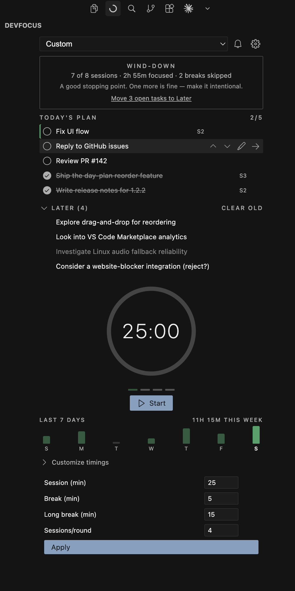
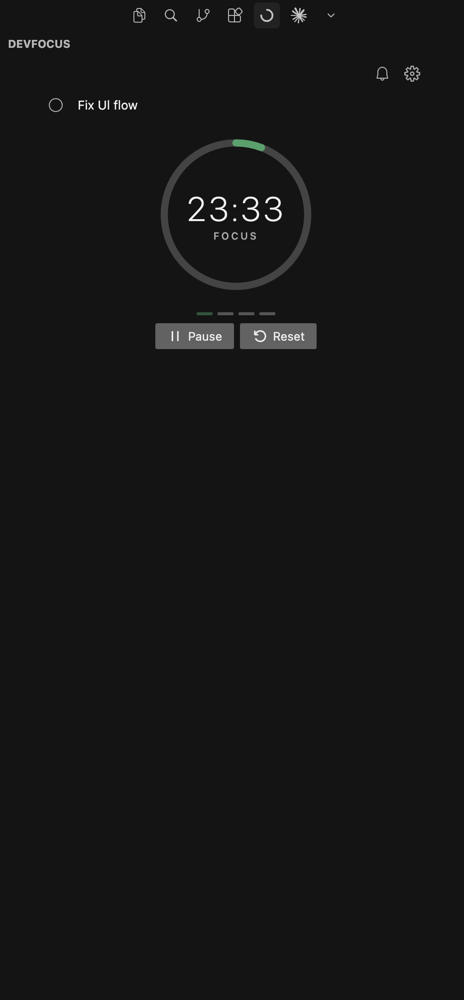
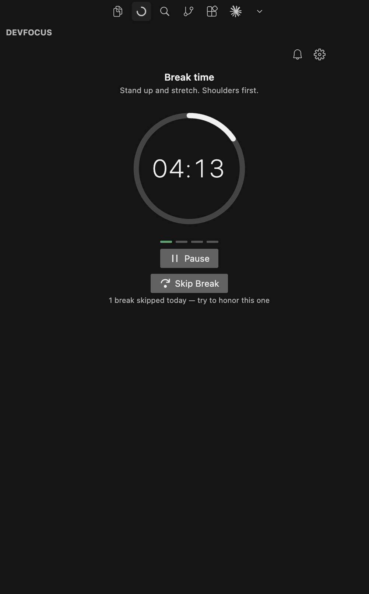
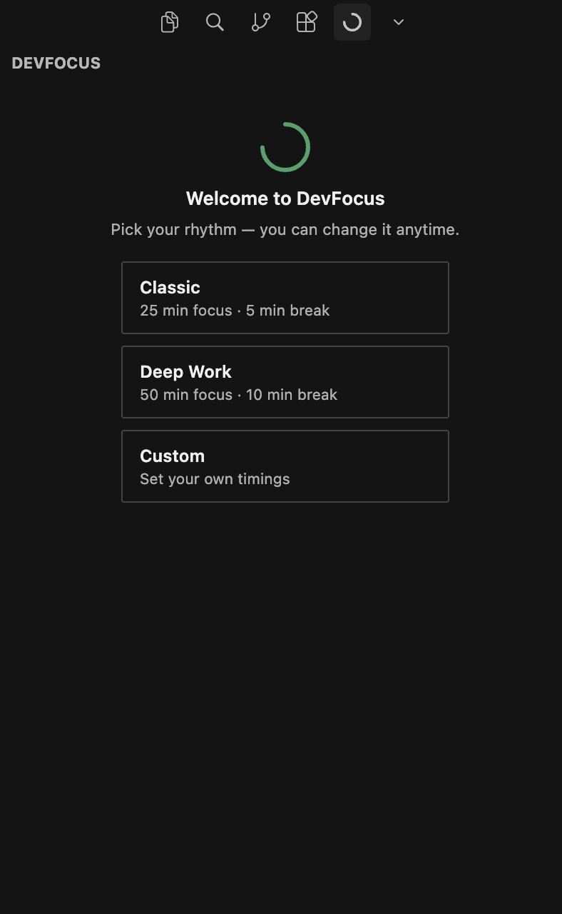
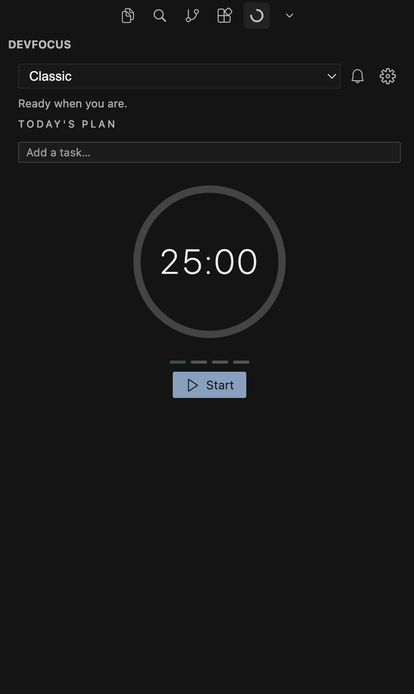
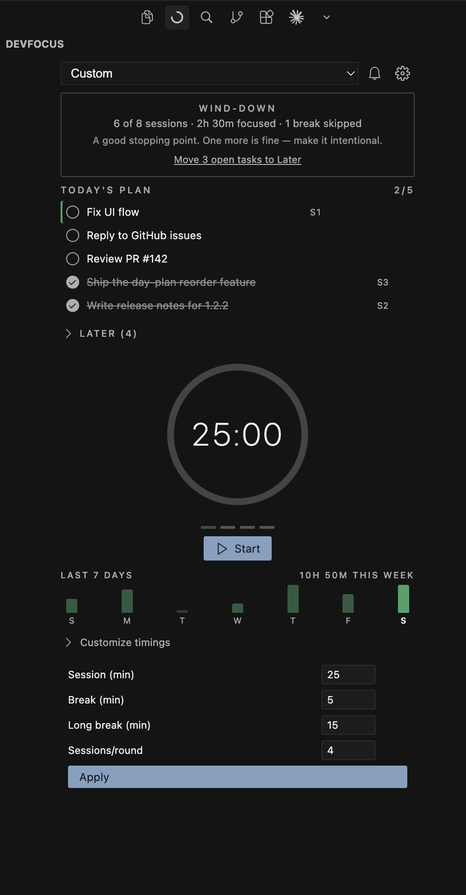

# DevFocus

**A focus timer and day plan for engineers working with AI.** Sessions, real
breaks, and a defensible end to the day — for the prompt → wait → review loop,
not the old 9-to-5.

| Today's plan | Focus | Break |
|---|---|---|
|  |  |  |

## Contents

- [Why](#why)
- [Screenshots](#screenshots)
- [Features](#features)
- [Getting Started](#getting-started)
- [Keyboard Shortcuts](#keyboard-shortcuts)
- [Modes](#modes)
- [Settings](#settings)
- [Design Principles](#design-principles)
- [Cursor IDE](#cursor-ide)
- [License](#license)

## Why

AI coding agents changed the shape of the work: it's no longer 25 minutes of
typing, it's prompt, wait, review, repeat. The old risk was losing focus. The
new one is never disengaging — agents remove the natural stopping points, so
nothing tells you when to rest or when the day is done. DevFocus is the pacing
layer for that loop: a plan for today, protected focus time, real breaks, and
a defensible end to the day.

## Screenshots

| First run — pick your rhythm | A clean start |
|---|---|
|  |  |

| Break time | Wind-down — a good stopping point |
|---|---|
|  |  |

## Features

### Focus, your way

- **Three modes** — Classic (25/5 min), Deep Work (50/10 min), and fully Custom
- **Circular dial** — a live countdown with session segments showing round progress
- **Status bar** — time, phase, and your current intent, always visible without opening the sidebar
- **Sound & notifications** — toggle either independently; calm, single-line copy
- **Persistent state** — survives restarts, restored as paused, never silently loses time

### Today's plan

- **Day plan** — write 3–5 tasks for today; the active one becomes your intent in the status bar and sessions count against it automatically
- **Reorder & rename in place** — priorities change; drag isn't required, hover reveals the controls
- **Complete mid-session** — check off the active task without stopping the timer; the next open one steps in
- **Later tray** — capture stray thoughts with `Alt+Shift+A` from anywhere, without leaving your code; promote them to today when their time comes

### Real breaks, not just timers

- **Daily goal & wind-down** — set a session target and an evening hour; after it, DevFocus nudges you to wrap up with a day summary instead of another session
- **Weekly rhythm** — a 7-day strip of your focus history and the week's total, kept locally for 30 days — a fact, not a streak to maintain
- **Skip-break friction** — skipping is always allowed, but the cost is visible, not hidden
- **Break suggestions** — a rotating, screen-appropriate nudge instead of a bare countdown

## Getting Started

1. Install DevFocus from the VS Code Marketplace or Open VSX
2. Click the DevFocus icon in the Activity Bar to open the panel
3. Pick a rhythm, write down what you're working on, and press **Start**

## Keyboard Shortcuts

| Action | Shortcut |
|---|---|
| Start / Pause | `Alt+Shift+D` |
| Skip Break | `Alt+Shift+B` |
| Capture a task to Later | `Alt+Shift+A` |

Reset has no default shortcut (it's destructive and rare) — run `DevFocus: Reset Timer` from the Command Palette, or bind your own key.

## Modes

| Mode | Session | Short Break | Long Break |
|---|---|---|---|
| Classic | 25 min | 5 min | 15 min |
| Deep Work | 50 min | 10 min | 30 min |
| Custom | your choice | your choice | your choice |

## Settings

| Setting | Default | Description |
|---|---|---|
| `devfocus.soundEnabled` | `true` | Play audio on phase transitions |
| `devfocus.autoStartNextSession` | `true` | Auto-start work session after break |
| `devfocus.notificationsEnabled` | `true` | Show desktop notifications |
| `devfocus.defaultMode` | `"CLASSIC"` | Mode applied on first launch |
| `devfocus.longBreakMinutes` | `15` | Default long break length for Custom mode |
| `devfocus.dailyGoal` | `8` | Daily session goal shown in panel and status bar (0 disables) |
| `devfocus.windDownTime` | `"18:00"` | After this hour DevFocus nudges you to wrap up (empty disables) |

## Design Principles

DevFocus is deliberately quiet: no accounts, no telemetry, no gamification.
Streaks were built and removed — loss-aversion mechanics punish rest, which
contradicts the point of the tool. Consistency shows up as facts (a rhythm
strip, a weekly total), never as a chain to maintain. Everything stays local.

The full reasoning — strategy, interaction rules, and pixel-level spec — is
written down, not just implemented:

- [`docs/UX_PLAN.md`](docs/UX_PLAN.md) — strategy and roadmap
- [`docs/UX_DESIGN.md`](docs/UX_DESIGN.md) — behavior, vocabulary, copy
- [`docs/UI_SPEC.md`](docs/UI_SPEC.md) — tokens, layout, motion

## Cursor IDE

DevFocus is fully compatible with [Cursor](https://cursor.sh). It uses only standard VS Code extension APIs.

## License

MIT © [akshayashokcode](https://github.com/AkshayAshokCode)
